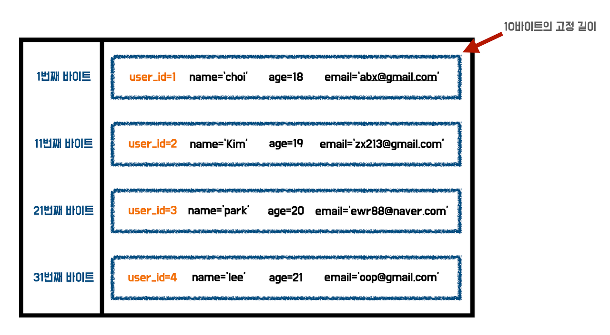
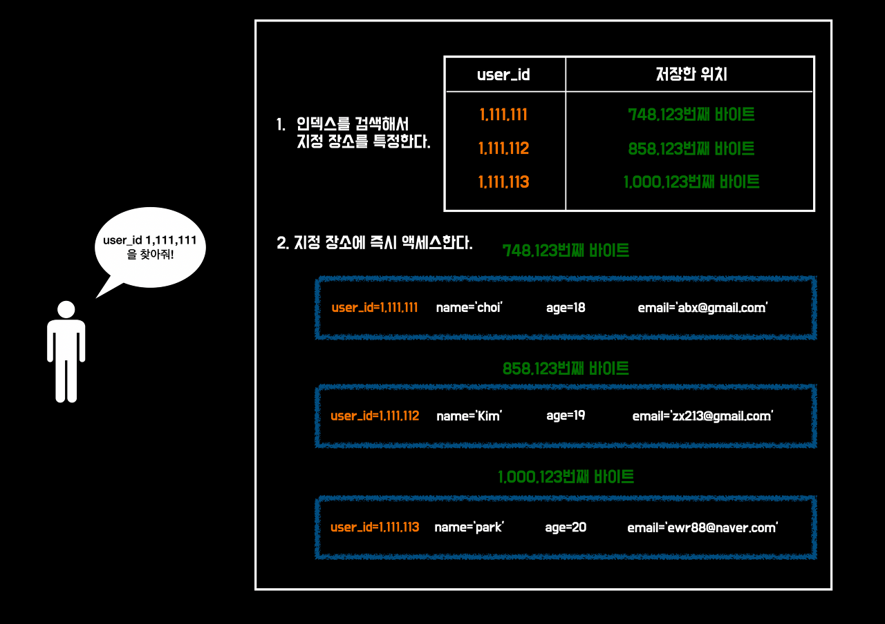

이번 스터디에서는 `대량의 데이터` 중에서 원하는 항목을 빠르게 검색하기 위해 데이터베이스가 필요한 이유와 인덱스에 대해서 자세히 알아본다.

어떠한 사이트의 사용자가 2,000,000(이백만명)이 있다고 가정하자.
개발자는 특정 사용자의 정보를 필요로 할 때가 있을 것이다.
예를 들어 `pk가 1,111,111`인 유저를 조회하고 싶다.

## 파일로 관리하기
첫 번째 방법은 `전체 조회`다.
데이터베이스 상에서의 전체 조회가 아닌 `텍스트 파일(txt)` 에서의 전체 조회를 뜻하는 것이다.
당연하게도 텍스트 파일에 사용자 정보를 관리하는 대규모 웹사이트는 존재하지 않는다.
이 이유에 대해서 알아보자.

위에 조회하고 싶은 유저를 A 유저라고 가정한다.
A 유저의 정보는 텍스트 파일 어딘가에 저장되어 있다.
하지만 텍스트 파일의 조회 방법은 무조건 전체 조회다.
다른 방법으로 타협할 수도 없다.

이러한 조회 방법을 `선형 검색`이라고 한다. 조회에 걸리는 시간은 텍스트 파일 크기에 비례한다.
파일의 크기가 2배가 되면 조회 시간도 2배로 늘어난다. 알고리즘으로 `O(N)의 계산량`이라고 부르기도 한다.
데이터가 N배가 되면 계산량도 N배가 되기 때문이다.

이 방법으로 어느정도의 데이터는 타협만 한다면 관리할 수 있을 수도 있다.
하지만 선형 검색은 검색 알고리즘에서 `가장 비효율적인 알고리즘`이다.

## 고정 길이로 관리하기
두 번째 방법은 유저 정보에 `고정된 데이터 크기`를 부여해서 관리하는 방법이다.
고정 길이로 관리하게 되면 파일 작업에서는 특정 위치로 순식간에 이동하는 것이 가능하다.
예를 들어 유저 데이터에 각각 10 바이트 고정해서 할당한다고 가정하면,
유저가 저장되는 위치는 유저 `ID(PK) * 10`과 같다.

> 사용자 정보 관리 파일

고정 길이 파일로 관리하면 pk와 데이터의 길이에 따라서 단순하게 정해지기 때문에 위와 같이 순식간에 조회가 가능하다.
하지만 이 방법 역시 `단점`이 있다.

### 고정 길이 유효성 검증
우선 10바이트라는 값에 대한 `유효성`에 대해서 생각해봐야 한다.
유저의 정보가 10바이트가 되지 않는다면 문제가 되지 않지만,
유저의 이메일이나 또 다른 정보들의 길이가 길다면?
10바이트를 충분히 초과할 수 있다.

또한 `새로운 데이터에 대한 제약`이 있다.
유저가 회원가입을 할 때마다 유저의 데이터 크기가 10바이트가 넘는지 검증을 해야하기 떄문이다.
그러면 이런 생각이 들 수도 있다. `"그냥 유저 한 명당 데이터 크기를 1GB씩 할당하면 안되나?"`

### 데이터 낭비
유저 한 명당 1GB를 할당해준다면 유저 정보 길이 때문에 제약사항이 생기거나,
검증을 위한 별도의 로직이 필요하지 않을 것이다. 하지만, 1GB의 데이터를 할당한 유저가 이백만명이다.
그러면 사용자 데이터에만 2,000,000GB를 사용하게 된다. 또한 이 용량의 대부분은 `공백`일 것이다.
유저 한명의 정보가 1GB를 다 사용하는 경우는 잘 없기 때문이다.

이 방식은 너무나 `자원낭비`가 심하다.
즉, 고정 길이 파일로 데이터를 관리하는 방식은 `효율성`과 `확장성`이 현저하게 떨어진다.

그러면 고정 길이 방식이 아니라 가변 길이 방식이면서 빠르게 조회할 수 있는 방법은 없을까?

## 인덱스 구조
우리는 일상 생활에서 예를 찾아볼 수 있다. 예로 책의 `찾아보기` 또는 `부록` 파트 정도가 될 것이다.
이 파트를 보면 책의 어느 페이지에 무슨 내용을 다루고 있으며 바로 내용을 찾아볼 수 있다.

이처럼 사용자 정보를 취급하는 가변 길이 포맷의 문서와는 별도로 각각의 유저 ID마다 파일 상의 시작
위치를 기록한 파일을 만들어서 고속으로 조회하는 방법을 `인덱스 구조`라고 부른다.

인덱스 파일은 `[유저 ID(key) : 바이트 위치(value)]`가 구성 요소가 되므로 빠르게 값을 얻을 수 있다. 또한 데이터에 키 값과 바이트 위치라는 두 가지 요소밖에 없기 때문에 사용자 정보와 같이 크기가 무한이 증가하는 일은 없다.

또한 키 값과 바이트 위치를 모두 `unsigned integer(정수형 4byte)`로 관리한다면
약 40억이라는 숫자까지 취급할 수 있기에 대부분의 경우 이 타입으로 충분히 관리할 수 있다.

따라서 이론적으로 레코드당 `8바이트(키 값, 바이트 위치)`로 관리할 수 있다. 인덱스 구조를 통한 조회 과정은 다음과 같다.

이 방법을 사용하면 고정 길이 방식보다 `확장성`을 가진 형태로 효율적으로 검색이 가능하다.
**액세스가 2단계 필요하다는 단점**이 있지만, 어느 쪽도 **데이터 양에 의존하지 않는 비용**으로 값을 취할
수 있기 때문에 데이터 양에는 의존하지 않고 **빠른 액세스**가 가능하다.

데이터 양에 의존하지 않는다는 말을 풀어서 설명하면 아래와 같다.

> `1번 과정`에서 인덱스에 액세스할 때 key와 value로 이루어져 있으며 이는 위에서 언급했듯이 unsigned integer형으로 선언하면 총 8byte로 하나의 레코드를 만들 수 있다.  
`2번 과정`에서 유저 정보에 액세스할 때는 고정 길이 방식 같이 이미 저장 용량을 할당해놓은 상태가 아니기에 딱 데이터 용량만큼 크기를 차지한다.
인덱스 자체는 Origin 데이터랑은 별개이기에 Origin 데이터를 업데이트할 때 인덱스도 별도로 업데이트 해야한다. 따라서 데이터 업데이트 비용은 증가하지만, 조회 기능을 눈에 띄게 고속화할 수 있다.

> 우리가 평소에 사용하는 데이터베이스에서는 Origin 데이터를 업데이트하면 인덱스도 함께 업데이트 되도록 설계되어 있다.

## 해시 인덱스
인덱스 항목은 key, value로만 이루어져, 고정 길이 포맷으로 대응할 수 있을 것이다.
하지만 키 값의 데이터 항목에 숫자 뿐만 아니라 `문자열`, `날짜/시간` 등 여러 타입으로 지정하고 싶을 수 있다.

이렇게 범용성을 추구한다면 키 값을 고정 길이로 귀착하는 것이 어렵다.
문자열로 관리할 때는 제일 긴 문자열을 기준으로 고정 길이 할당을 해야하는데 이렇게 하면 공간 낭비가 생긴다.

실제 데이터베이스에서는 키 값을 그대로 사용하지 않고, 키를 `해시 함수`에 넣어서 `해시 키`로 사용한다. 데이터베이스 상에서 인덱스 항목은 `hash key : value`인 셈이다.
이러한 구조를 `해시 인덱스`라고 한다.

해시 값은 문자열 길이에 상관없이 동일한 크기이므로 `고정 길이 포맷`으로 대응할 수 있다.
또한 `해시 계산 비용`은 데이터의 양에 의존하지 않기 때문에 데이터 양이 기하급수적으로 늘어도 **계산량은 변하지 않는다**.
이러한 특성 때문에 **가장 빠른 검색 알고리즘**으로 분류되며 `O(1)`의 속도를 가진다.

실제로 해시를 사용하다 보면 다른 키 값을 가져도 **같은 해쉬가 나올 확률**이 있는데,
이를 막기 위해서 키 값의 충돌을 감지하여 실제 일치하는지에 대한 여부를 확인하는 구조가 필요하다.

데이터베이스에서는 당연히 이런 기능을 가지고 있으며,
아무리 계산 속도가 O(1)이라고 해도 충돌 판정을 해서 쟤계산하는 로직이 추가되기에 데이터 양이 증가하면 **평균 처리 속도는 증가**한다.
그래도 전체 검색과는 비교 불가능할 정도로 빠른 속도를 가진다.

## 해시 인덱스도 만능은 아니다
해시 인덱스가 많은 데이터에 대해서 조회를 하거나 업데이트를 할 때 막강한 성능을 보여줄 수 있지만,
다음과 같은 행위에 대해서는 해시 인덱스를 사용할 수 없다.

1. 얼마 이하인 숫자를 찾고 싶다.
2. 어떠한 문자열로 시작하는 문자열을 찾고 싶다.
3. 어떠한 컬럼순으로 정렬하고 싶다.
### 1. 얼마 이하인 숫자를 찾고 싶다.
1의 예에서 검색의 키가 되는 것은 `얼마`라는 숫자이다.
예를 들어서 얼마라는 수를 10,000이라고 가정하자. 10,000은 검색의 키가 되는것이다.
10,000 이하의 수는 10,000, 9,999, 9,998... 정말 많은 숫자들이 반환되어야 한다.

따라서 조회의 결과가 여러개인데, 해시 인덱스의 구조는 지정한 키 값과 일치하는
key 값의 value 밖에 찾지 못하기에 위와 같은 목적으로 사용하기에는 해시 인덱스가 적합하지 않다.

### 2. 어떠한 문자열로 시작하는 문자열을 찾고 싶다.
위와 같은 이유다. 어떠한 문자열이라는 것을 `우아한`이라고 한다면, 이 문자열로 시작하는 문자열들은 여러개가 될 수 있다. ex) 우아한형제들, 우아한테크코스, 우아한테크캠프...

### 3. 어떠한 컬럼순으로 정렬하고 싶다.
정렬을 한다는 것은 여러 레코드를 조회해서 어떠한 컬럼을 기준으로 순서를 매긴다는 것인데,
이 과정에서 한 번에 여러개의 컬럼을 조회하고 비교해야 하기 떄문에 해시 인덱스는 적합하지 않다.

이를 해결하기 위해서 `B+Tree 인덱스`를 사용하며 `RDBMS`에서 실제 용도를 상정하여 인덱스에 대한 다양한 최적화를
실시하고 있다.
이러한 최적화의 예로 `고유성 보장`, `멀티 컬럼 인덱스`, `인덱스만 읽는 검색`, `인덱스 병합` 등이 있다.

## 정리
데이터 건수의 증가에 비례하여 검색 시간이 늘어나면 많은 양의 데이터를 처리해야 하는 환경에서
제대로 동작할 수 없다.
따라서 인덱스 기술로 이를 해결하고 인덱스가 어떻게 동작하는지 알아보았다.

하지만 인덱스를 무작적 사용하는 것이 좋은 것은 아니다.
`색인`을 위한 데이터를 가지고 있어야기에 **데이터 크기가 증가**하고,
이를 업데이트 하기 위해선 별도의 처리도 필요하다.

업데이트 속도의 저하는 특히 데이터의 양이 서서히 증가함에 따라 심하며 **필요한 컬럼**에만
균형있게 설정하여 사용하는 것이 좋다.
어떤 컬럼이 인덱스에 적합하고, 어떤 항목이 적합하지 않은지를 판단하려면 `사전 설계 작업`이 중요하다.